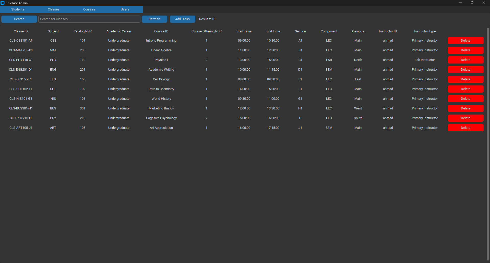
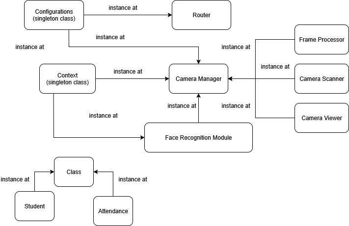
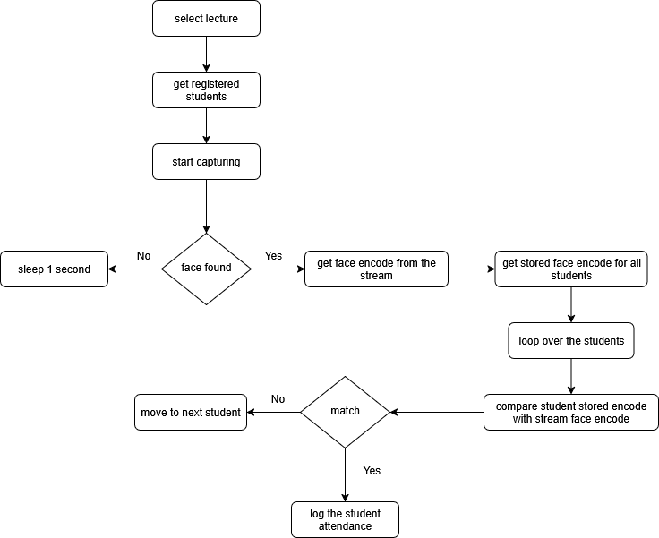
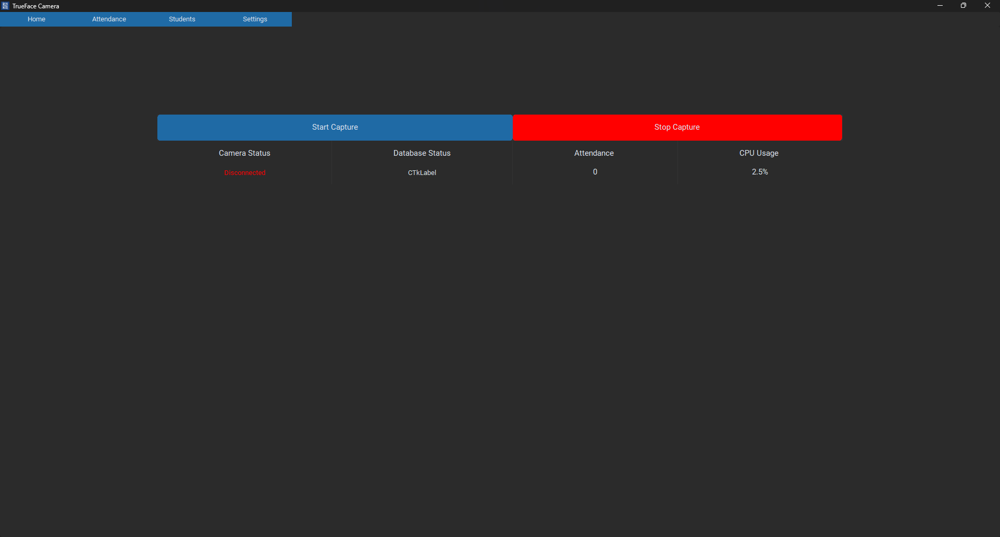

# TrueFace: AI-Powered Attendance Management

[](https://www.python.org/)
[](https://www.djangoproject.com/)
[](https://www.docker.com/)
[](https://www.jenkins.io/)
[](LICENSE)

TrueFace is an advanced attendance management solution that leverages **real-time facial recognition technology** to automate and streamline attendance tracking. It provides a seamless, accurate, and secure system for identifying individuals and recording their presence.

---

## System Architecture

TrueFace is composed of three primary decoupled components working together seamlessly:

1. **TrueFace Backend API**: A robust Django REST API managing all database operations, course listings, user accounts, and real-time attendance logs.
2. **TrueFace Admin App**: A CustomTkinter-based desktop interface for administrators to manage student databases, course schedules, and overall system configuration.
3. **TrueFace Camera App**: A real-time face-recognition camera client that captures frames, runs highly-optimized detection algorithms (supporting standard or KD-Tree based classification), and automatically uploads attendance to the Backend API.

---

## Prerequisites & Environment Compatibility

Because of specific hardware acceleration and native libraries (such as `dlib`), Python version compatibility is critical across different components:

| Component | Target Python Version | Key Dependencies | Primary Database |
| :--- | :--- | :--- | :--- |
| **TrueFace-Backend** | **Python 3.11+** | Django 4.2.x, DRF, SQLite (default) / MySQL | SQLite / MySQL |
| **TrueFace-Admin** | **Python 3.9** *(Strict)* | CustomTkinter, OpenPyXL, Pillow, dlib | Connects to Backend API |
| **TrueFace-Cam** | **Python 3.9** *(Strict)* | CustomTkinter, OpenCV, face_recognition, dlib | Connects to Backend API |

> [!WARNING]  
> **Python 3.9 Strict Requirement**: Both the Admin and Camera desktop apps use a pre-compiled `dlib` binary (`dlib-19.22.99-cp39-cp39-win_amd64.whl`) targeting Windows 64-bit platforms running Python 3.9. Attempting to install this wheel on other Python versions (e.g., 3.10+) will result in installation failures. Ensure you set up a virtual environment specifically with **Python 3.9** for these two applications.

---

## Installation & Setup

### 1. TrueFace-Backend Setup
The Backend API manages all attendance data and client requests.

#### Local Development Setup
1. **Navigate to the Backend directory:**
   ```bash
   cd Trueface-Backend
   ```
2. **Set up the virtual environment & install requirements:**
   ```bash
   python3 -m venv env
   # On Windows:
   .\env\Scripts\Activate.ps1
   # On Unix/macOS:
   source env/bin/activate

   pip install -r requirements.txt
   ```
3. **Configure Environment Variables:**
   Copy the example environment file and configure it with your settings:
   ```bash
   cp env.example .env
   ```
   Open the `.env` file and adjust settings (e.g., debug settings, secret key, JWT credentials, or database settings).
4. **Database Configuration:**
   - **SQLite (Default):** Ready out of the box. No external database server configuration required.
   - **MySQL (Optional):** Ensure MySQL is running, configure `DB_HOST`, `DB_PORT`, `DB_NAME`, `DB_USER`, and `DB_PASSWORD` in `.env`, and install the MySQL client.
5. **Run Database Migrations:**
   ```bash
   python manage.py makemigrations
   python manage.py migrate
   ```
6. **Start the Development Server:**
   ```bash
   python manage.py runserver
   ```
   The backend API will be available at `http://127.0.0.1:8000/`.

#### Docker Deployment Setup
The backend is completely containerized. To build and run using Docker:
```bash
docker build -t trueface-django:latest .
docker run -d --name trueface-django -p 8000:8000 \
  -e SECRET_KEY="your-secret-key" \
  -e DEBUG="False" \
  trueface-django:latest
```

---

### 2. TrueFace-Admin Setup
The Admin System provides a GUI for managing attendance data and system configurations.

1. **Navigate to the Admin directory:**
   ```bash
   cd TrueFace-Admin
   ```
2. **Set up a Python 3.9 virtual environment:**
   ```bash
   # Ensure python3.9 is used
   py -3.9 -m venv env
   .\env\Scripts\Activate.ps1
   ```
3. **Install Requirements & Pre-Compiled dlib Wheel:**
   ```bash
   pip install -r requirements.txt
   pip install dlib-19.22.99-cp39-cp39-win_amd64.whl
   ```
4. **Launch the Admin Application:**
   ```bash
   python main.py
   ```
5. **Compilation to Standalone Executable:**
   You can compile the application to a standalone Windows `.exe` using PyInstaller:
   ```bash
   python -m PyInstaller .\main.py -w -D --collect-all face_recognition_models --icon logo.ico
   ```

---

### 3. TrueFace-Cam Setup
The Camera System handles real-time facial recognition and sends logs directly to the Backend API.

1. **Navigate to the Camera directory:**
   ```bash
   cd TrueFace-Cam
   ```
2. **Set up a Python 3.9 virtual environment:**
   ```bash
   # Ensure python3.9 is used
   py -3.9 -m venv env
   .\env\Scripts\Activate.ps1
   ```
3. **Install Requirements & Pre-Compiled dlib Wheel:**
   ```bash
   pip install -r requirements.txt
   pip install dlib-19.22.99-cp39-cp39-win_amd64.whl
   ```
4. **Launch the Camera Client:**
   ```bash
   python main.py
   ```
5. **Compilation to Standalone Executable:**
   Compile the application into a standalone executable:
   ```bash
   python -m PyInstaller .\main.py -w -D --collect-all face_recognition_models --icon logo.ico
   ```

> [!TIP]
> **KD-Tree Acceleration**: The Camera System features KD-Tree search support for high-speed, scalable facial identification, reducing classification times significantly when tracking thousands of students.

---

## 🛠️ CI/CD Deployment (Jenkins)

The project includes a ready-to-use `Jenkinsfile` for automated pipeline execution. It features:
* **Target Build Parameterization:** Build and package the `TrueFace-Admin`, `TrueFace-Cam`, or `Trueface-Backend`.
* **Automated Dockerization:** Automatically builds, terminates old containers, and deploys the backend container on successful checkouts.
* **Credentials Management:** Securely passes database hosts, users, passwords, and JWT secret tokens via Jenkins credentials store.

---

## 🖼️ Visuals

### Admin System Interface
Below is a screenshot showcasing the intuitive user interface of the TrueFace Admin System.


### Camera System Diagrams

<p align="center"><em>Figure 1: System Architecture of the Camera System</em></p>


<p align="center"><em>Figure 2: Real-Time Face Recognition Flow</em></p>

### Camera System Interface
Here's a glimpse of the TrueFace Camera System in action.


---

## 📄 License

This project is licensed under the MIT License - see the [LICENSE](LICENSE) file for details.
