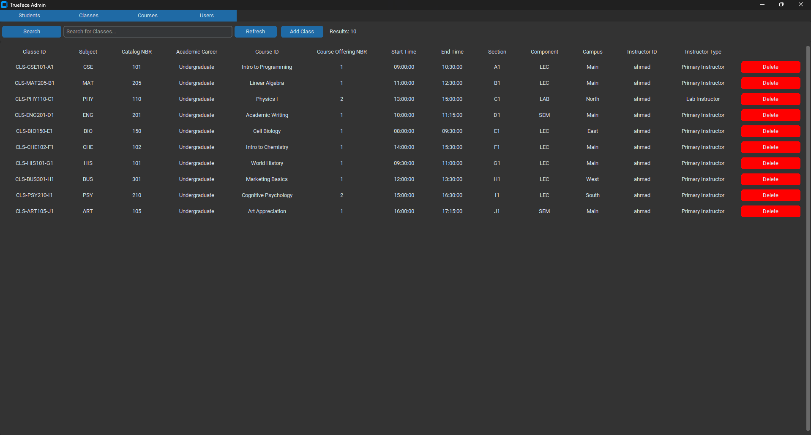
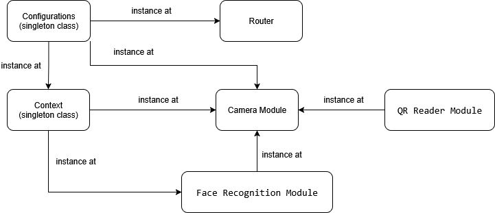
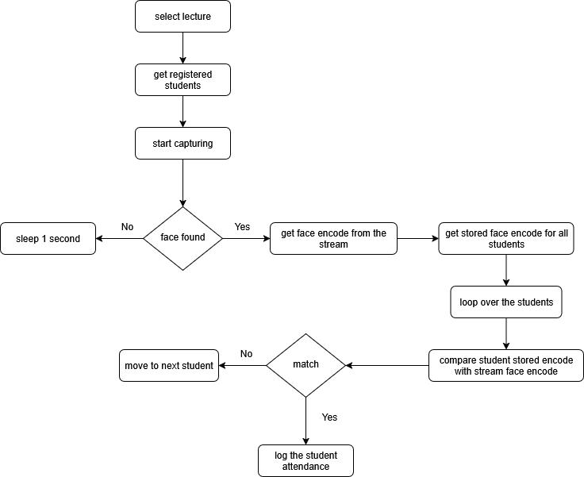
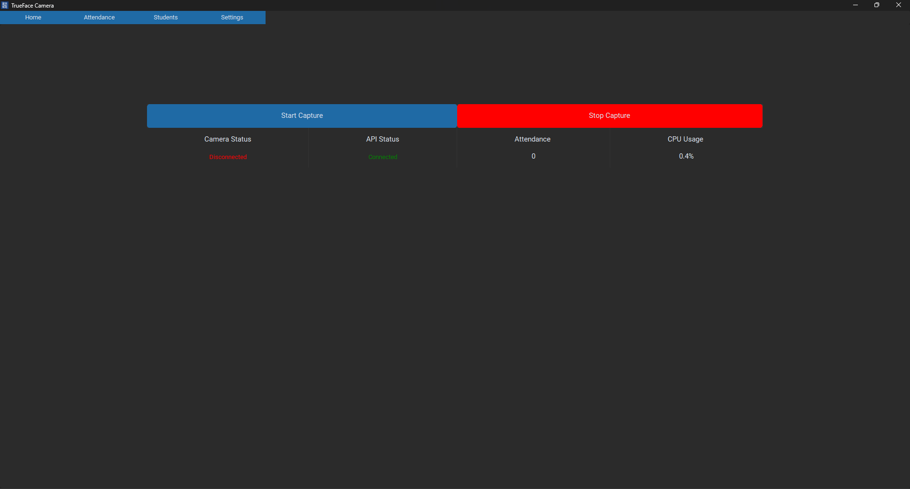

# TrueFace: AI-Powered Attendance Management 🤖

TrueFace is an advanced attendance management solution that leverages **real-time facial recognition technology** to automate and streamline attendance tracking. It provides a seamless, accurate, and secure system for identifying individuals and recording their presence.

---

## Key Features ✨
* **Effortless Face Recognition:** Automatically records attendance using state-of-the-art facial recognition.
* **Real-Time Data Capture:** Processes and updates attendance records instantly, ensuring up-to-the-minute accuracy.
* **Robust Django API:** Features a powerful backend API built with Django, facilitating efficient data management and interaction.
* **Dockerized Deployment:** Ensures easy and consistent deployment across environments with full Docker support and automated pushes to DockerHub.
* **Flexible Database Integration:** Offers easily configurable database connections, supporting various relational databases beyond just MySQL.

---

## Getting Started 🚀
To get started with TrueFace, ensure you have the following prerequisites installed:

### Prerequisites
* **Python 3.9+**: The core language for TrueFace.
* **Docker**: Essential for containerization and simplified deployment.
* **MySQL**: The default database for storing attendance data. While configurable, MySQL is recommended for initial setup.

---

### Installation & Setup
TrueFace comprises three main components: the **Admin System**, the **Camera System**, and the **Backend API**. Each component has a straightforward installation process.

#### 1. Backend API Installation
The Backend API manages all attendance data and interactions.
1.  **Set up the environment:**
    ```bash
    python3 -m venv env
    source env/bin/activate
    pip install -r requirements.txt
    ```
2.  **Configure Database:** Navigate to `settings.py` and update the `DATABASES` dictionary with your MySQL connection details.
3.  **Run Migrations:**
    ```bash
    python3 manage.py makemigrations
    python3 manage.py migrate
    ```
4.  **Start the Server:**
    ```bash
    python3 manage.py runserver
    ```

#### 2. Admin System Installation
The Admin System provides a user interface for managing attendance data and system configurations.
1.  **Set up the environment:**
    ```bash
    python3.9 -m venv env
    source env/bin/activate
    pip install -r requirements.txt
    ```
2.  **Run the application:**
    ```bash
    python3 main.py
    ```

#### 3. Camera System Installation
The Camera System handles real-time facial recognition and attendance capture.
1.  **Set up the environment:**
    ```bash
    python3.9 -m venv env
    source env/bin/activate
    pip install -r requirements.txt
    ```
2.  **Run the application:**
    ```bash
    python3 main.py
    ```

---

## Visuals 📸
### Admin System Interface
Below is a screenshot showcasing the intuitive user interface of the TrueFace Admin System.


### Camera System Diagrams
* **Configrations**: Contains the system's global configuration settings.
* **Context**: Holds the system's global data.
* **Router**: Manages navigation between views.
* **Camera Module**: Controls camera functions.
* **Face Recognition Module**: Handles face recognition processes.
* **QR Reader Module**: Contains the system's global configuration settings.


<p align="center"><em>Figure 1: System Architecture of the Camera System</em></p>

The following diagram explains the process of capturing and identifying the student.

<p align="center"><em>Figure 2: Real-Time Face Recognition Flow</em></p>

### Camera System Interface
Here's a glimpse of the TrueFace Camera System in action.

